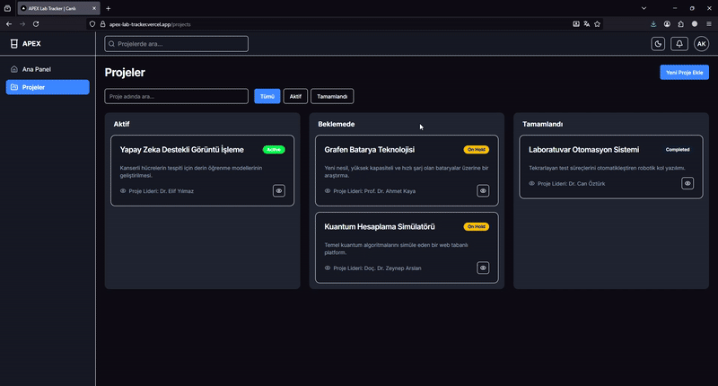

# APEX - Academic Project & Experiment X-tracker

APEX, bir araştırma laboratuvarındaki projeleri, deneyleri, kullanılan kaynakları ve çıkan yayınları yönetmek için tasarlanmış modern ve interaktif bir web uygulamasıdır. Bu proje, bir staj programı kapsamında, en güncel frontend teknolojileri ve en iyi pratikler kullanılarak sıfırdan oluşturulmuştur.



## Ana Özellikler

- **İnteraktif Kanban Panosu:** Projeleri durumlarına göre (`Aktif`, `Beklemede`, `Tamamlandı`) sütunlar arasında sürükleyip bırakarak yönetin. Hem sütunlar arası taşıma hem de sütun içi sıralama desteklenmektedir.
- **"Optimistic UI" Güncellemeleri:** Kullanıcı eylemleri (taşıma, sıralama vb.), API cevabını beklemeden arayüze anında yansıtılarak kesintisiz ve akıcı bir kullanıcı deneyimi sunar.
- **Kapsamlı Proje Yönetimi:** Projeler için tam CRUD (Oluşturma, Okuma, Güncelleme, Silme) işlevselliği.
- **Dashboard ve Veri Görselleştirme:** Proje metriklerine (toplam, aktif proje sayısı vb.) genel bir bakış sunan ana panel ve proje durum dağılımını gösteren interaktif pasta grafiği (`Recharts`).
- **Gelişmiş Arayüz Özellikleri:**
    - **Arama ve Filtreleme:** Projeler arasında metin ve durum bazlı arama ve filtreleme.
    - **Karanlık Mod:** `next-themes` ve CSS Değişkenleri ile oluşturulmuş, sistem tercihine duyarlı, tam kapsamlı karanlık tema.
    - **Sayfalama:** Çok sayıda projeyi verimli bir şekilde yönetmek için sunucu tarafı sayfalama.
    - **Duyarlı Tasarım:** Mobil, tablet ve masaüstü cihazlarda sorunsuz bir kullanım deneyimi.
- **Kalite Güvencesi ve Test:**
    - **Birim Testleri:** `Jest` ve `React Testing Library` ile kritik bileşenlerin (örn: form validasyonu) doğruluğunu garanti eden testler.
    - **Uçtan Uca (E2E) Testler:** `Cypress` ile ana kullanıcı akışlarının (örn: yeni proje oluşturma) baştan sona otomatik olarak test edilmesi.
- **Modern Geliştirici Deneyimi (DX):**
    - `Husky` ve `lint-staged` ile commit öncesi otomatik kod formatlama ve lint kontrolü.
    - `Storybook` ile izole edilmiş, interaktif bileşen dokümantasyonu.

## Kullanılan Teknolojiler

### Frontend

- **Framework:** Next.js (App Router)
- **Dil:** TypeScript
- **Stil:** TailwindCSS (CSS Değişkenleri ile)
- **Durum Yönetimi (State Management):** Zustand (Client State), TanStack Query (Server State & Caching)
- **Form Yönetimi ve Validasyon:** React Hook Form & Zod
- **Sürükle ve Bırak:** Dnd-Kit
- **UI Kütüphaneleri:** Radix UI (Headless Bileşenler), Lucide React (İkonlar)
- **Grafikler:** Recharts
- **Bildirimler:** Sonner
- **Test:** Jest, React Testing Library, Cypress
- **Dokümantasyon:** Storybook

### Backend (Simülasyon)

- **API:** Next.js Route Handlers ile oluşturulmuş Mock API

## Projeyi Yerel Makinede Çalıştırma

1.  **Depoyu klonlayın:**
    ```bash
    git clone [SENİN GITHUB REPO LİNKİN]
    ```
2.  **Proje dizinine gidin:**
    ```bash
    cd apex-lab-tracker
    ```
3.  **Bağımlılıkları yükleyin:**
    ```bash
    npm install
    ```
4.  **Geliştirme sunucusunu başlatın:**
    ```bash
    npm run dev
    ```

Uygulama artık `http://localhost:3000` adresinde çalışıyor olacaktır.

## Gelecek Planı (Roadmap)

Bu projenin gelecekteki versiyonları için planlanan bazı özellikler şunlardır:

- [ ] **Gerçek Kimlik Doğrulama (Authentication):** `NextAuth.js` kullanılarak kullanıcı girişi, kaydı ve oturum yönetimi.
- [ ] **Veritabanı Entegrasyonu:** Mock API yerine, `PostgreSQL` ve `Prisma` ORM kullanılarak gerçek bir veritabanına geçiş.
- [ ] **Gelişmiş Yetkilendirme:** Projeleri sadece belirli kullanıcıların görebilmesi veya düzenleyebilmesi.
- [ ] **Dosya Yükleme:** Projelere ilgili dokümanların (PDF, resim vb.) yüklenebilmesi.
- [ ] **Detaylı Dashboard:** Tarih aralığına göre filtreleme ve daha fazla grafik çeşidi ekleme.